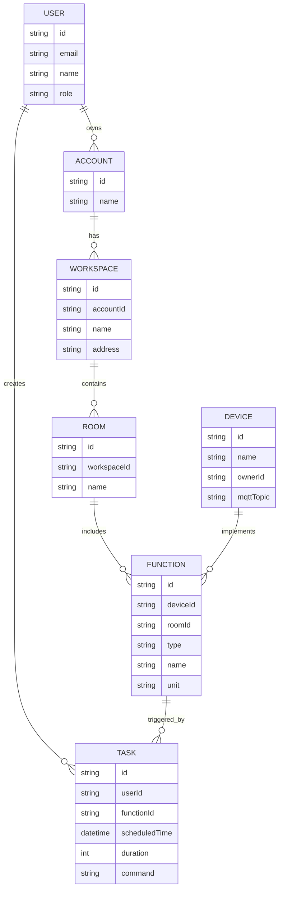
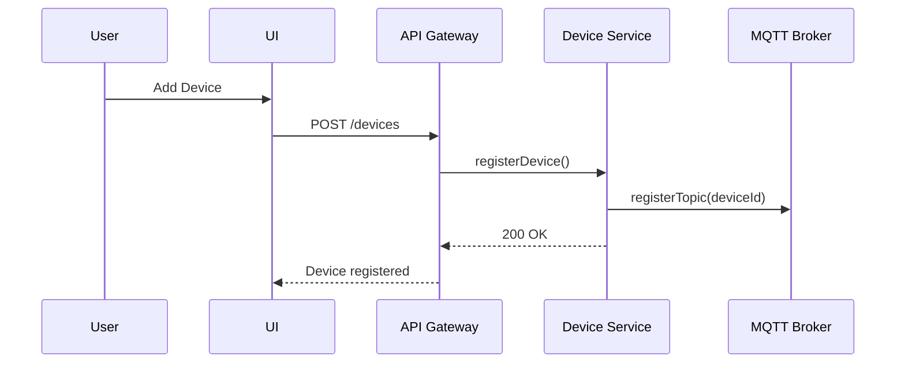
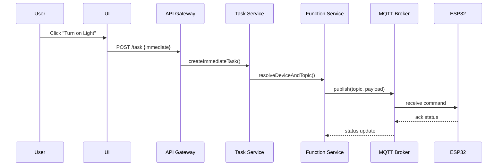
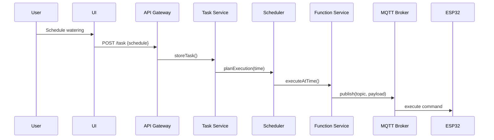
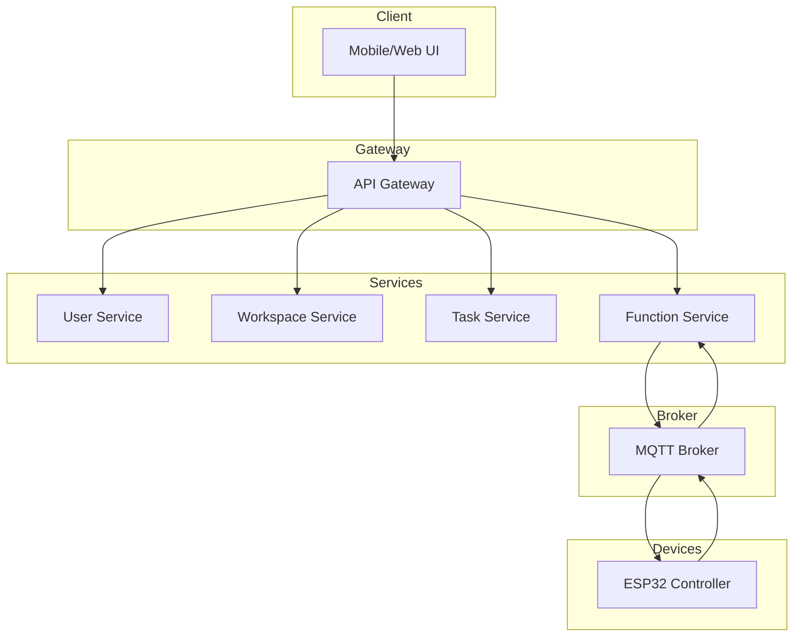

# smart-home
Monorepo for smart home 


### 1. Entity Relationship Diagram (ERD)


### 2. DTO Examples
```ts
// RegisterUserRequestDTO
{
  email: string,
  password: string,
  name: string
}

// CreateWorkspaceRequestDTO
{
  accountId: string,
  name: string,
  address: string
}

// BindDeviceDTO
{
  deviceId: string,
  accountId: string,
  mqttTopic: string
}

// CreateFunctionDTO
{
  deviceId: string,
  roomId: string,
  type: "light" | "watering" | "blinds" | "temperature" | "humidity",
  name: string
}

// CreateTaskDTO
{
  functionId: string,
  command: string,
  scheduledTime?: datetime,
  duration?: number
}
```

### 3. Flow Diagrams
#### 3.1 Device Binding Flow


#### 3.2 Execute Function Immediately


#### 3.3 Scheduled Task Flow


---

### 4. C4 Container Diagram (Level 2)


---

### 5. Security Considerations
- HTTPS + OAuth2/JWT between client and services
- mTLS or API key auth between services
- TLS-secured MQTT with per-device credentials
- Role-based access (owner, user, guest)
- Each task/function/device scoped per account
